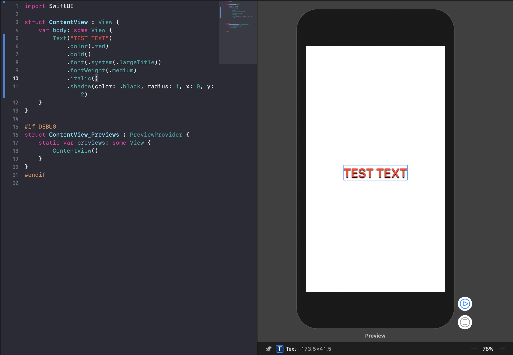
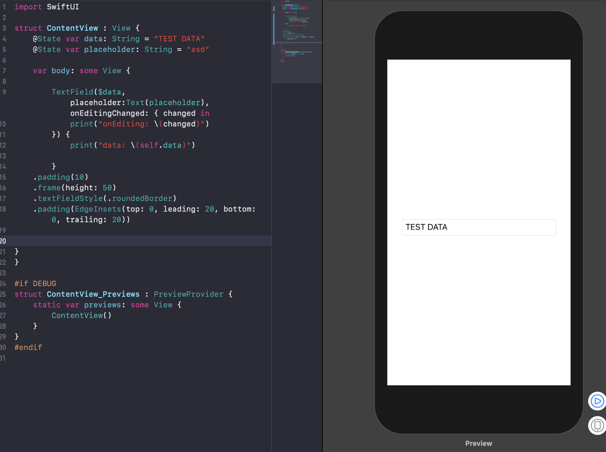
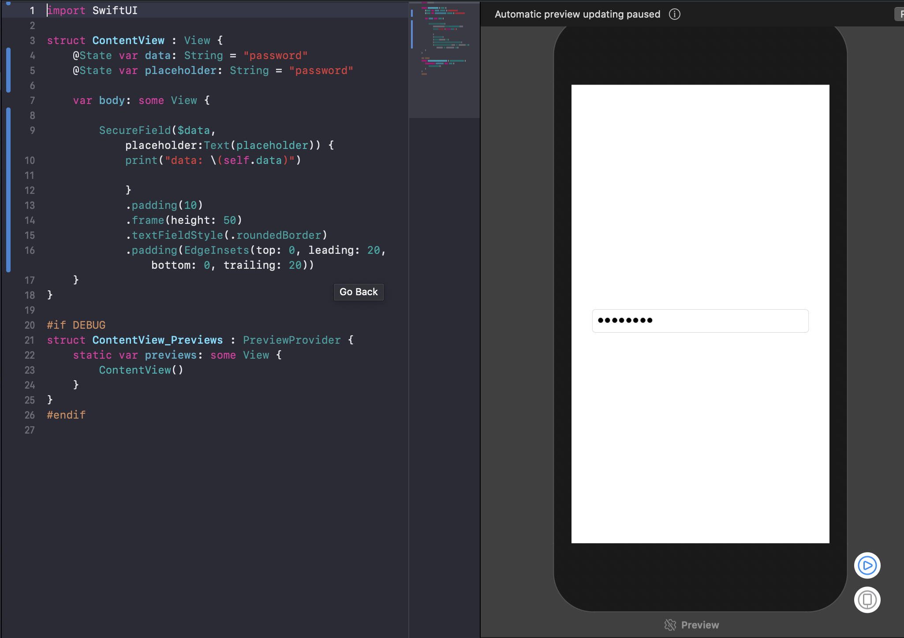
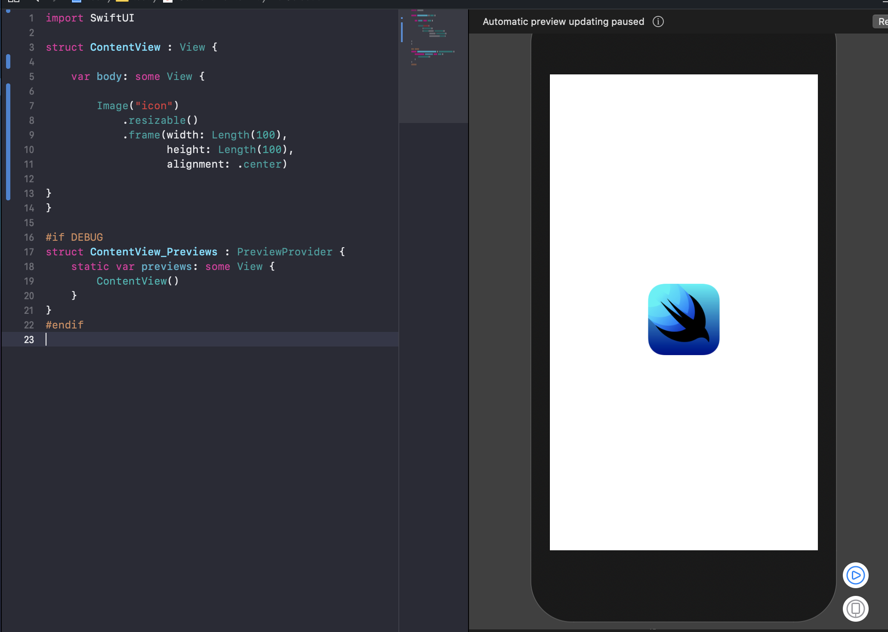
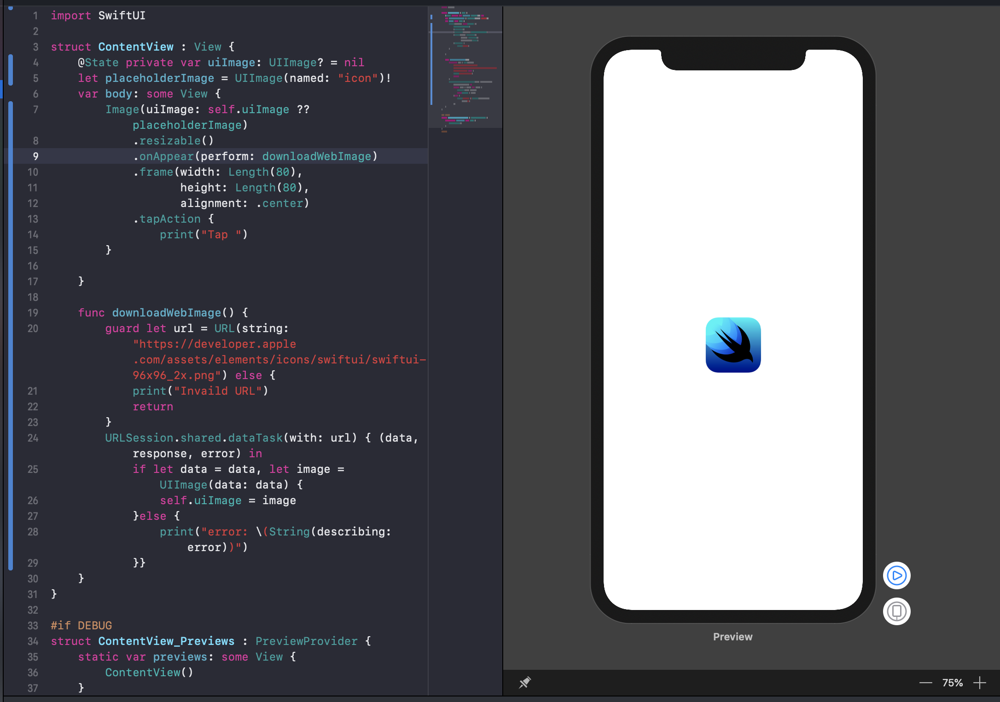
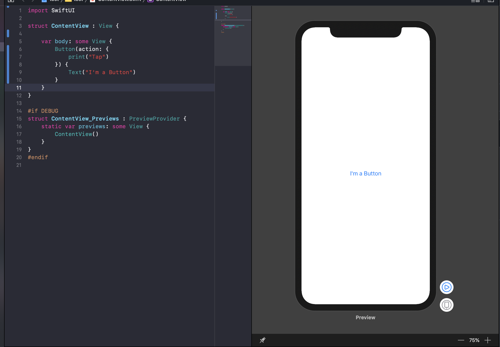
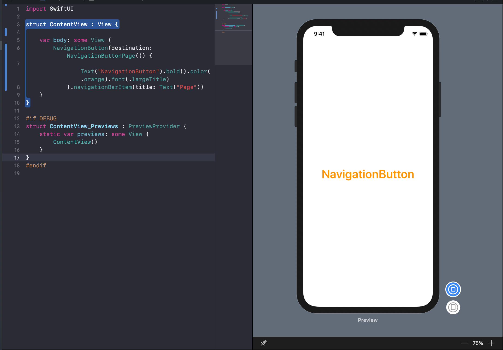
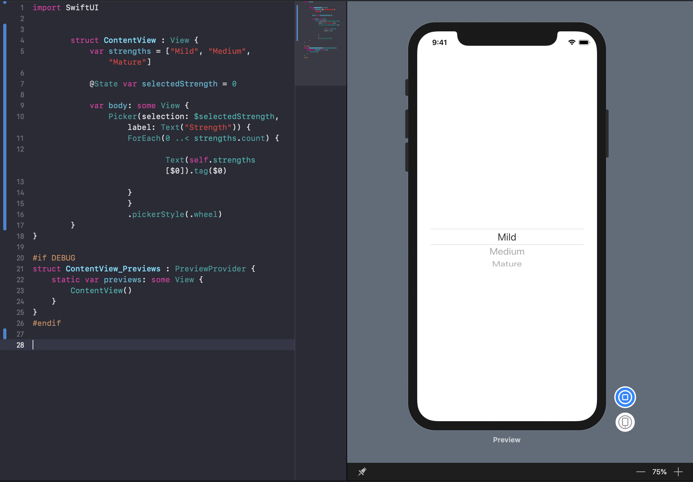
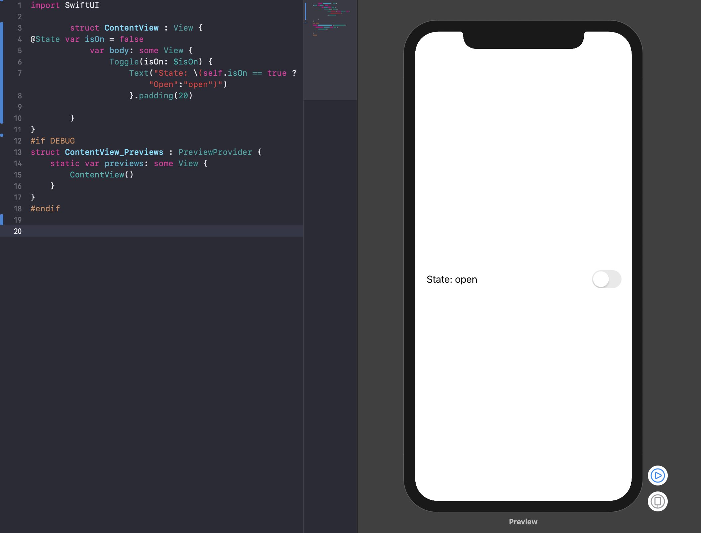

[]("https://developer.apple.com/assets/elements/icons/swiftui/swiftui-96x96_2x.png")


[](https://swift.org)
[](https://developer.apple.com/xcode)
[](https://developer.apple.com/macOS)
[](https://opensource.org/licenses/GPL-3.0)

이 페이지는 [중국의 Jinxiansen의 SwiftUI 레포지토리](https://github.com/Jinxiansen/SwiftUI)를 참고해서 번역하였습니다. 

이 글에 대한내용 은 기본적으로 스위프트 개발을 해보신 분들을 대상으로 잡고있습니다. 그래서 모든 디테일적인 부분을 다루진 않습니다. 혹시나 스위프트의 문법적인 부분이 필요하시다면 [Swift](https://swift.org) 링크를 참고해주세요 :)

사실 필자도 스위프트에 대한 전문적 이해, SwiftUI에 대한 전문적 이해가 있는것이 아니라서, 틀린 부분이 있을수도 있습니다. 그런부분이 있다면 [Facebook](https://fb.com/wooyoung.han.5) 또는 [Mail](mailto:hwymaster01@gmail.com) 로 연락 주시거나 github issue 를 남겨주세요 :) 


### 💻 지원 환경

- macOS 15 Beta
- Xcode 11.0 Beta
- iOS 13.0 Beta


## 목차 : 

### 기본 요소

* <span id="Text_D">텍스트</span>
	- [Text](#Text)
	- [TextField](#TextField)
	- [SecureField](#SecureField)

* <span id="Image_D">이미지</span>
	- [Image](#Image)
	- [WebImage](#WebImage)

* <span id="Button_D">버튼</span>
	- [Button](#Button)
	- [NavigationButton](#NavigationButton)
	- [PresentationButton](#PresentationButton)
	- [EditButton](#EditButton)
	- [PasteButton](#PasteButton)
	- [Picker](#Picker)
	- [DatePicker](#DatePicker)
	- [Toggle](#Toggle)
	- [Slider](#Slider)
	- [Stepper](#Stepper)
	- [SegmentedControl](#SegmentedControl)

* <span id="Special_D">기타(?)</span>
	- [WebView](#WebView)
	- [UIViewController](#UIViewController)

### <span id="Layout_D">레이아웃</span>
	
* <span id="Stacks_D">스택</span>
	- [HStack](#HStack)
	- [VStack](#VStack)
	- [ZStack](#ZStack)

* <span id="List_D">리스트</span>
	- [List](#List)
	- [ScrollView](#ScrollView)
	- [ForEach](#ForEach)

* <span id="Container_D">컨테이너 뷰</span>
	- [Group](#Group)
	- [GroupBox](#GroupBox)
	- [Section](#Section)

* <span id="Architectural_D">Architectural Views</span>
	- [NavigationView](#NavigationView)
	- [TabbedView](#TabbedView)
	- [HSplitView](#HSplitView)
	- [VSplitView](#VSplitView)

* <span id="Alert_D"> 알림(Alert) </span>
	- [Alert](#Alert)
	- [Modal](#Modal)
	- [Popover](#Popover)
	- [Sheet](#Sheet)
	- [ActionSheet](#ActionSheet)


### <span id="State_D">State 와 Data Flow</span>

* <span id="Bindings_D"> 바인딩 </span>
	* [Binding](#Binding)

* <span id="Data_D"> Data-Dependent Views </span>
	* [State](#State)
	* [ObjectBinding](#ObjectBinding)
	* [EnvironmentObject](#EnvironmentObject)

* <span id="Environment_D"> Environment Values </span>
	* [Environment](#Environment)
	* [EnvironmentValues](#EnvironmentValues)

* <span id="ENavigation_D"> ENavigation Models </span>
	* [DynamicNavigationDestinationLink](#DynamicNavigationDestinationLink)

* <span id="Preferences_D"> 속성 </span>
	* [LocalizedStringKey](#LocalizedStringKey)

* <span id="Transactions_D"> Transactions </span>
	* [Transaction](#Transaction)


### <span id="Gestures_D">제스쳐</span>

* <span id="BasicGestures_D"> 기본 제스쳐 </span>
	* [TapGesture](#TapGesture)
	* [LongPressGesture](#LongPressGesture)
	* [DragGesture](#DragGesture)
	* [MagnificationGesture](#MagnificationGesture)
	* [RotationGesture](#RotationGesture)

* <span id="Combined_D"> 복합 제스쳐 </span>
	* [SequenceGesture](#SequenceGesture)
	* [SimultaneousGesture](#SimultaneousGesture)
	* [ExclusiveGesture](#ExclusiveGesture)

* <span id="Custom_D"> 커스텀 제스쳐 </span>
	* [AnyGesture](#AnyGesture)


<h2 id="Basic View">Basic View</h2>


<h4 id="Text">Text</h4>


`Text` 는 한줄이나, 그 이상의 텍스트를 `UILabel` 과 같은 형태로 나타 내어 줍니다.

만약 `Text` 를 생성 하고자 한다면, 그냥 `Text("하고싶은말");` 과 같은 형태로 진행하면 됩니다.
그리고, 폰트,색깔,그림자, 마진(~~??? : And I also, 마진조아~~)을 줄 수 있습니다.

예제:

```swift
Text("TEST TEXT")
    .color(.red)
    .bold()
    .font(.system(.largeTitle))
    .fontWeight(.medium)
    .italic()
    .shadow(color: .black, radius: 1, x: 0, y: 2)
```

<details close>
  <summary>결과 보기</summary>
  
</details>


[🔝](#Text_D) 
--
<h4 id="TextField"> TextField </h4>
 
 `TextField` 는 일반적으로 사용하는 텍스트 상자 와 같아서, 텍스트 입력을 받을 수 있습니다.

예제:

```swift

        TextField($data, placeholder:Text(placeholder), onEditingChanged: { changed in
            print("onEditing: \(changed)")
        }) {
            print("data: \(self.data)")

        }
    .padding(10)
    .frame(height: 50)
    .textFieldStyle(.roundedBorder)
    .padding(EdgeInsets(top: 0, leading: 20, bottom: 0, trailing: 20))
}
}
```
**만약 에러가 뜬다면,**

  `self.data` 쪽에서 에러가 뜨거나 placeholder 에서 에러가 뜬다면 `name` 이나 `placeholde` State가 선언되지 않았을 가능성이 큽니다. 
  
`var body: some View {` 위에
   ```swift
   @State var data: String = ""
   @State var placeholder: String = "let's input data"
   ````
   와 같은 형태로 선언을 해주세요!

<details close>
  <summary>결과 보기</summary>

</details>

[🔝](#Text_D) 
-- 
<h4 id="SecureField"> SecureField </h4>

`SecureField` 는 일반적으로 패스워드 입력에 많이 사용된다. 사용방법은 `TextField` 와 동일하다. 

예제:

```swift
    SecureField($data, placeholder:Text(placeholder), onEditingChanged: { changed in
            print("onEditing: \(changed)")
        }) {
            print("data: \(self.data)")

        }
    .padding(10)
    .frame(height: 50)
    .textFieldStyle(.roundedBorder)
    .padding(EdgeInsets(top: 0, leading: 20, bottom: 0, trailing: 20))
}
}
```
**만약 에러가 뜬다면,**

  `self.data` 쪽에서 에러가 뜨거나 placeholder 에서 에러가 뜬다면 `name` 이나 `placeholde` State가 선언되지 않았을 가능성이 큽니다. 
  
`var body: some View {` 위에
   ```swift
   @State var data: String = ""
   @State var placeholder: String = "let's input data"
   ````
   와 같은 형태로 선언을 해주세요!

<details close>
  <summary>결과 보기</summary>

</details>

<h4 id="Image"> Image </h4>

`Image` 는 사진을 보여주기 위해 사용됩니다

예제:
```swift
Image("icon")
    .resizable()
    .frame(width: Length(100),
           height: Length(100),
           alignment: .center)
```

이미지는 Assets에 추가해주세요!
이미지 추가하는 법이 궁금하시다면... [요링크로](https://www.edwith.org/boostcourse-ios/lecture/16842)

<details close>
  <summary>결과 보기</summary>

</details>

[🔝](#Text_D)

<h4 id="WebImage"> WebImage </h4>

웹상의 이미지를 `Image` 를 통해 띄우려면, `URLSession` 을 사용해서, 직접 `downloadWebImage` 함수를 만들어서 사용 할 수 있습니다.

Example：

```swift
var body: some View {
        Image(uiImage: self.uiImage ?? placeholderImage)
            .resizable()
            .onAppear(perform: downloadWebImage)
            .frame(width: Length(80),
                   height: Length(80),
                   alignment: .center)
            .tapAction {
                print("Tap ")
        }

    }

  func downloadWebImage() {
    guard let url = URL(string: "https://developer.apple.com/assets/elements/icons/swiftui/swiftui-96x96_2x.png") else {
      print("Invaild URL")
      return
    }
    URLSession.shared.dataTask(with: url) { (data, response, error) in 
    if let data = data, let image = UIImage(data: data) {
      self.uiImage=image
    }else {
        print("error: \(String(describing: error)))
    }}
  }
```
만약 에러가 난다면, `var body: some View {` 위에 
```swift
 @State private var uiImage: UIImage? = nil
    let placeholderImage = UIImage(named: "icon")!
  ```
를 입력해주세요!

<details close>
  <summary>결과 보기</summary>

</details>

[🔝](#Text_D)

<h4 id="Button"> Button </h4>

`Button` 은, 클릭 이벤트를 발생시키기 위해 사용됩니다.

Example:

```swift
Button(action: {
    print("Tap")
}) {
   Text("I'm a Button")
}
```
<details close>
  <summary>결과 보기</summary>

</details>

[🔝](#Button_D)

<h4 id="NavigationButton"> NavigationButton </h4>

`NavigationButtonPage ` 는 눌러사 다음 네비게이션 페이지로 가기 위해 사용됩니다.

Example:

```swift
NavigationButton(destination: NavigationButtonPage()) {
    Text("NavigationButton").bold().color(.orange).font(.largeTitle)
    }.navigationBarItem(title: Text("Page"))
```     
만약 `NavigationButtonPage 선언과 관련해서 오류`가 뜬다면,
새로운 swiftui 파일을 하나 만들고, 페이지 이름을 `NavigationButtonPage` 으로 만들어주세요!

<details close>
  <summary>결과 보기</summary>

</details>

[🔝](#Button_D)

<h4 id="PresentationButton"> PresentationButton </h4>

`PresentationButton` 은 **페이지를 팝업으로** 띄우기 위해서 사용됩니다.

Example:

```swift
PresentationButton(PageRow(title: "PresentationButton", subTitle: "pop up a page"),
                   destination: Text("I'm Text")) {
                    print("Present 🦄")
                   }
```     

<details close>
  <summary>결과 보기</summary>

</details>

[🔝](#Button_D)

<h4 id="EditButton"> EditButton </h4>

`EditButton` is used to trigger the editing state, just use the `navigationBarItems` setting when using it. 

Example:

```swift
navigationBarItems(trailing: EditButton())
```     

<details close>
  <summary>결과 보기</summary>

</details>

[🔝](#Button_D)

<h4 id="PasteButton"> PasteButton </h4> 

Waiting for release.
 

<h4 id="Picker"> Picker </h4>

`Picker` can customize the selector of the data source.

Example:

```swift
Picker(selection: $leftIndex, label: Text("Picker")) {
    ForEach(0..<leftSource.count) {
        Text(self.leftSource[$0]).tag($0)
    }
    }.frame(width: UIScreen.main.bounds.width/2)
```     

<details close>
  <summary>결과 보기</summary>

</details>

[🔝](#Picker_D)

<h4 id="DatePicker"> DatePicker </h4>

`DatePicker` is used to select the absolute date of the control.

Example:

```swift
DatePicker(
    $server.date,
    minimumDate: Calendar.current.date(byAdding: .year,
                                       value: -1,
                                       to: server.date),
    maximumDate: Calendar.current.date(byAdding: .year,
                                       value: 1,
                                       to: server.date),
    displayedComponents: .date
)
```     

<details close>
  <summary>결과 보기</summary>

</details>

[🔝](#Picker_D)

<h4 id="Toggle"> Toggle </h4>

`Toggle` is used to switch the selected state, for example:

```swift
Togglele(isOn: $isOn) {
    Text("State: \(self.isOn == true ? "Open":"open")")
}.padding(20)
```

<details close>
  <summary>결과 보기</summary>

</details>

[🔝](#Picker_D)

<h4 id="Slider"> Slider </h4>

`Slider ` A control for selecting values from a finite range of values, example:

```swift
Slider(value: $data.rating)
```     

<details close>
  <summary>결과 보기</summary>

</details>
 
 [🔝](#Picker_D)

<h4 id="Stepper"> Stepper </h4>

`Stepper ` is used to increase or decrease the value, example:

```swift
Stepper(value: $value, step: 2, onEditingChanged: { c in
    print(c)
}) {
    Text("Stepper Value: \(self.value)")
    }.padding(50)
```

<details close>
  <summary>결과 보기</summary>

</details>

[🔝](#Picker_D)

<h4 id="SegmentedControl"> SegmentedControl </h4>

`SegmentedControl ` is used for segmentation condition selection, example:

```swift
SegmentedControl(selection: $currentIndex) {
    ForEach(0..<items.count) { index in
        Text(self.items[index]).tag(index)
    }
    }.tapAction {
        print("currentIndex: \(self.currentIndex)")
}
```

<details close>
  <summary>결과 보기</summary>

</details>

[🔝](#Picker_D)

<h4 id="WebView"> WebView </h4>

`WebView` is used to display an open web page, example:

```swift
struct WebViewPage : UIViewRepresentable {
    func makeUIView(context: Context) -> WKWebView  {
        return WKWebView()
    }
    func updateUIView(_ uiView: WKWebView, context: Context) {
        let req = URLRequest(url: URL(string: "https://www.apple.com")!)
        uiView.load(req)
    }
}
```

<details close>
  <summary>결과 보기</summary>

</details>

[🔝](#Special_D)

<h4 id="UIViewController"> UIViewController </h4>

`UIViewController` is used to display the **UIViewController** that opens **UIKit** in **SwiftUI** and opens the `SwiftUI` View in **UIViewController**.

Example:

First define:

```swift
struct ControllerPage<T: UIViewController> : UIViewControllerRepresentable {
    
    typealias UIViewControllerType = UIViewController
    
    func makeUIViewController(context: UIViewControllerRepresentableContext<ControllerPage>) -> UIViewController {
        return T()
    }
    
    func updateUIViewController(_ uiViewController: UIViewController, context: UIViewControllerRepresentableContext<ControllerPage>) {
        debugPrint("\(#function)：\(type(of: T.self))")
    }
    
}
```

Then use this:

```swift
NavigationButton(destination: ControllerPage<UIKitController>()) {
    PageRow(title: "UIViewController",subTitle: "Open UIViewController")

}
```


<details close>
  <summary>결과 보기</summary>


</details>

[🔝](#Special_D)


### Layout 


<h4 id="HStack"> HStack </h4>

`HStack` is used to arrange the subviews on a horizontal line. 

Example:

```swift
HStack {
    Text("made in China.")
    Divider() // Just add a line.
    Text("the People's Republic Of China.")
}
```

<details close>
  <summary>결과 보기</summary>

</details>

[🔝](#Layout_D)

<h4 id="VStack"> VStack </h4>

`VStack` is used to arrange the subviews on a vertical line.

Example:

```swift
VStack {
    Text("made in China.")
    Divider() // Just add a line.
    Text("the People's Republic Of China.")
}
```

<details close>
  <summary>결과 보기</summary>

</details>

[🔝](#Layout_D)

<h4 id="ZStack"> ZStack </h4>

`ZStack` is used to override the subview, aligned on two axes.

Example:

```swift
ZStack {
    Text("made in China.")
    Divider() // Just add a line.
    Text("the People's Republic Of China.")
}
```

<details close>
  <summary>결과 보기</summary>

</details>

[🔝](#Layout_D)

<h4 id="List"> List </h4>

`List` list container to display a list of data.

Examples:

```swift
List(0..<5) { item in
    Text("Hello World !")
}.navigationBarTitle(Text("List"), displayMode: .large)
```

<details close>
  <summary>결과 보기</summary>

</details>

[🔝](#Layout_D)

<h4 id="ScrollView"> ScrollView </h4>

`ScrollView` is a scroll view container.

Example:

```swift
ScrollView {
    Text("SwiftUI").padding(20)
    Divider()
    Image("icon").resizable()
        .frame(width: 300, height: 300, alignment: .center)
    Divider()
    Text("Views and ... user interface.")
    }
    .border(style, width: 1,cornerRadius: 10)
    .padding(10)
    .navigationBarTitle(Text("ScrollView"))
```

<details close>
  <summary>결과 보기</summary>

</details>

[🔝](#Layout_D)

<h4 id="ForEach"> ForEach </h4>

`ForEach` is used to present a view based on a collection of existing data.

Example:

```swift
let data = (0..<5).map { $0 }
var body: some View {
    ForEach(data) { e in
        Text("Hello \(e)")
            .bold()
            .font(.system(size: 25, design: .monospaced))
            .padding(5)
}
```

<details close>
  <summary>결과 보기</summary>

</details>

[🔝](#Layout_D)

<h4 id="Group"> Group </h4>

`Group` is used to aggregate multiple views, and the properties set on the Group will be applied to each child view.

Example:

```swift
Group {
    Text("Hello World !")
    Text("Hello World !")
    }
```

<details close>
  <summary>결과 보기</summary>

</details>

[🔝](#Layout_D)
 
<h4 id="GroupBox"> GroupBox </h4>

Waiting for release.


<h4 id="Section"> Section </h4>

`Section` is used to create the **header/footer** view content, which is generally used in conjunction with the `List` component.

Example:

```swift
Section(header: Text("I'm header"), footer: Text("I'm footer")) {
    ForEach(0..<3) {
        Text("Hello \($0)")
    }
}
```

<details close>
  <summary>결과 보기</summary>

</details>

[🔝](#Layout_D)
 
<h4 id="NavigationView"> NavigationView </h4>

`NavigationView` is used to create a view container that contains the top navigation bar.

Example:

```swift
NavigationView {
    Text("🧚‍♂️🧚‍♀️🧜‍♂️🧜‍♀️🧞‍♂️🧞‍♀️").blur(radius: 5)
    Text("Swifter Swifter").bold().color(.orange).font(.largeTitle)
}.navigationBarTitle(Text("NavigationView"))
```

<details close>
  <summary>결과 보기</summary>

</details>

[🔝](#Layout_D)

<h4 id="TabBar"> TabBar </h4>

`TabBar` is used to create a view container that contains the bottom **TabBar**.

Example:

```swift
TabbedView(selection: $index) {
    ForEach(0 ..< imgs.count) { item in
        TabItemPage(index: item)
            .tabItemLabel(Image(self.imgs[item]))
            .tag(item)
    }
}
```

<details close>
  <summary>결과 보기</summary>

</details>

[🔝](#Layout_D)

<h4 id="HSplitView"> HSplitView </h4> 

Waiting for release.

<h4 id="VSplitView"> VSplitView </h4> 

Waiting for release.

[🔝](#Layout_D)

<h4 id="Alert"> Alert </h4>

`Alert` is used to display a bullet reminder that needs to be associated with a trigger event.

Example:

```swift
presentation($showsAlert, alert: {
                Alert(title: Text("Hello"))
            })
```

<details close>
  <summary>결과 보기</summary>

</details>

[🔝](#Alert_D)


<h4 id="ActionSheet"> ActionSheet </h4>

`ActionSheet` is used to pop up a selection box.

Example:

```swift
ActionSheet(title: Text("Title"),
            message: Text("Message"),
            buttons:
    [.default(Text("Default"), onTrigger: {
        print("Default")
        self.showSheet = false
    }),.destructive(Text("destructive"), onTrigger: {
        print("destructive")
        self.showSheet = false
    }),.cancel({
        print("Cancel")
        self.showSheet = false
    })])
```

<details close>
  <summary>결과 보기</summary>

</details>

[🔝](#Alert_D)


<h4 id="Modal"> Modal </h4>

`Modal` is used to pop up a view.

Example:

```swift
Modal(Text("Modal View"),onDismiss: {
    print("View Dismiss !")
})
```

<details close>
  <summary>결과 보기</summary>

</details>

[🔝](#Alert_D)


<h4 id="Popover"> Popover </h4>

`Popover` is used to pop up a view, see the results below.

Example:

```swift
Popover(content: Text("Popover View")) {
    print("Popover Dismiss !")
}
```

<details close>
  <summary>결과 보기</summary>

</details>

[🔝](#Alert_D)

## 📎 About

* 여기 있는 모든 샘플코드는 Example project 안에 포함되어 있습니다. 
* 만약, 여기 적힌 샘플 코드보다 깔끔하고 이쁘게 만들어 주실수 있으시다면 꼭 이슈를 넣어주세요!! (~~필자는 스위프트 알못입니다~~)
* 만약 여기 예제코드에 에러가 있거나, 궁금한게 있으시다면 [**Issue**](https://github.com/cokia/SwiftUI-cheetsheet-kor/issues/new) 를 남겨주세요!!
 


## ✉️ Contacts

Mail : hanu@hanukoon.com

Facebook : [한우영](https://fb.com/wooyoung.han.5)

Github : [cokia](https://github.com/cokia)


## 📄 License	

SwiftUI CheatSheet 프로젝트는 [GPL-3.0 license](LICENSE) 입니다 :) 